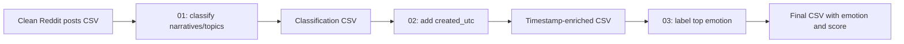

# Homeless Sentiment Analysis

This project analyzes Canadian homelessness-related Reddit posts for narrative classification and emotion detection.

## Prerequisites

### Install uv

`uv` is a fast Python package installer and resolver. Install it on your operating system:

#### Windows

```powershell
powershell -c "irm https://astral.sh/uv/install.ps1 | iex"
```

#### macOS

```bash
curl -LsSf https://astral.sh/uv/install.sh | sh
```

#### Linux

```bash
curl -LsSf https://astral.sh/uv/install.sh | sh
```

After installation, you may need to restart your terminal or add uv to your PATH.

## Getting Started

1. **Clone the repository** (if you haven't already):

   ```bash
   git clone <repository-url>
   cd Homeless_Sentiment
   ```

2. **Sync dependencies** using uv:

   ```bash
   uv sync
   ```

   This command will:
   - Create a virtual environment
   - Install all required dependencies from `pyproject.toml`
   - Lock dependencies for reproducible builds

3. **Run the numbered CSV workflow** described below.

The original exploratory notebook remains available for analysis and visualization. Open
`sentiment_emotion_pipeline.ipynb` in VS Code using the kernel created by `uv`, or start
Jupyter with:

```bash
uv run jupyter lab
```

Then navigate to `sentiment_emotion_pipeline.ipynb` and run the cells.

## Script Workflow

The recommended workflow is a three-stage pipeline. Each stage writes a new CSV that becomes the input to the next stage:



### 1. Classify narratives and specific topics

Set an OpenAI API key, then run the multithreaded classifier. It uses 12 workers by default and saves a resumable checkpoint:

```bash
export OPENAI_API_KEY="your-api-key"

uv run python 01_classify_homelessness_narratives.py \
  --input homeless_reddit_04-05-2026_clean_posts.csv \
  --output homelessness_narrative_topic_classification.csv \
  --checkpoint homelessness_classification_checkpoint_revised_themes.jsonl
```

Reduce concurrency if needed with `--workers 4`. The input must contain `post_id`, `text`, `city`, and `url`.

The revised themes taxonomy changes the values in `narrative` and `specific_topic`. Start it with a new checkpoint (as shown above) and do not combine its output or checkpoint rows with classifications created under the previous taxonomy.

### 2. Add and normalize `created_utc`

Match the original post metadata to the classification output using `post_id`:

```bash
uv run python 02_add_created_utc.py
```

This creates `homelessness_narrative_topic_classification_with_created_utc.csv` and formats timestamps as `YYYY-MM-DD HH:MM:SS`.

### 3. Add the top emotion and score

The final script downloads and runs `cardiffnlp/twitter-roberta-base-emotion-multilabel-latest` from Hugging Face. It selects the highest-scoring emotion for each non-empty `text` value:

```bash
uv run python 03_emotion_labeling.py \
  --input homelessness_narrative_topic_classification_with_created_utc.csv
```

This creates `homelessness_narrative_topic_classification_with_created_utc_with_emotion.csv` with two additional columns: `emotion` and `emotion_score`. Use `--batch-size 8` to reduce memory usage.

### 4. Generate narrative word clouds

Create an aggregate cloud for all relevant narrative categories plus one cloud for each of the four substantive narratives:

```bash
uv run python 04_word_clouds.py
```

The word-cloud workflow detects English and French spans with Lingua,
excludes spans confidently identified as another language, and lemmatizes the
remaining English/French text with spaCy. Uncertain or unidentified spans are
kept. Install the language models once before running it:

```bash
python -m spacy download en_core_web_sm
python -m spacy download fr_core_news_sm
```

The script reads `homelessness_narrative_topic_classification.csv` by default and saves the following PNGs to `wordclouds/`: `all_narratives.png`, `housing_crisis.png`, `public_life_crisis.png`, `society_moral_crisis.png`, and `governance_and_policy_challenge.png`. It removes English and French stopwords, homelessness terms that would otherwise dominate the clouds, and the additional words listed in the committed `config/wordcloud_excluded_words.txt` and `config/wordcloud_geography_excluded_words.txt` files. Use `--input <csv>` and `--output-dir <directory>` to override the default paths.

## Project Structure

- `canadian_homelessness_reddit_posts.csv` - Raw Reddit post data
- `reddit_posts_with_sentiment_emotion.csv` - Processed data with sentiment/emotion labels
- `01_classify_homelessness_narratives.py` - OpenAI narrative/topic classification
- `02_add_created_utc.py` - Add and normalize timestamps using `post_id`
- `03_emotion_labeling.py` - Hugging Face top-emotion labeling
- `04_word_clouds.py` - Narrative-specific word-cloud generation
- `sentiment_emotion_pipeline.ipynb` - Exploratory sentiment/emotion analysis notebook
- `redditCrawl.ipynb` - Data collection notebook
- `main.py` - Python script version
- `pyproject.toml` - Project dependencies and configuration
- `requirements.txt` - Legacy requirements file

## Notebook Usage

Run all cells in `sentiment_emotion_pipeline.ipynb` sequentially to:

1. Load the Reddit posts data
2. Apply sentiment analysis
3. Detect emotions in the posts
4. Generate visualizations and insights

## Output Files

The notebook generates `reddit_posts_with_sentiment_emotion.csv` with the following columns:

### Basic Information

- **id** - Unique Reddit post identifier
- **city** - Canadian city associated with the post
- **title** - Original post title
- **selftext** - Original post body text
- **combined_text** - Concatenated title and selftext used for analysis
- **score** - Reddit post score (upvotes - downvotes)
- **num_comments** - Number of comments on the post
- **created_utc** - Post creation timestamp
- **url** - Direct link to the Reddit post

### Sentiment Analysis Results

- **sentiment_consensus** - Final sentiment prediction based on majority vote from all models (`positive`, `negative`, or `neutral`)
- **sentiment_roberta_label** - Sentiment from Twitter-RoBERTa model
- **sentiment_roberta_score** - Confidence score for Twitter-RoBERTa prediction (0-1)
- **sentiment_siebert_label** - Sentiment from SiEBERT model
- **sentiment_siebert_score** - Confidence score for SiEBERT prediction (0-1)
- **sentiment_bertweet_label** - Sentiment from BERTweet model
- **sentiment_bertweet_score** - Confidence score for BERTweet prediction (0-1)

### Emotion Analysis Results

- **emotion_roberta_primary** - Primary emotion from Twitter-RoBERTa emotion model
- **emotion_roberta_primary_score** - Confidence score for primary emotion (0-1)
- **emotion_distilroberta_primary** - Primary emotion from DistilRoBERTa model (7 basic emotions)
- **emotion_distilroberta_primary_score** - Confidence score for primary emotion (0-1)
- **emotion_multilabel_labels** - Comma-separated list of emotions detected by multi-label model
- **emotion_goemotions_top3** - Top 3 emotions from GoEmotions model (Reddit-specific, 28 emotions)

### Models Used

**Sentiment Analysis (3 models):**

- Twitter-RoBERTa (CardiffNLP) - Social media optimized
- SiEBERT (RoBERTa-large) - General purpose
- BERTweet - Social media specific

**Emotion Classification (4 models):**

- Twitter-RoBERTa (single-label) - Basic emotions
- Twitter-RoBERTa (multi-label) - Multiple emotions per post
- GoEmotions - Reddit-specific with 28 emotion categories
- DistilRoBERTa - 7 basic emotions (6 Ekman + neutral)
